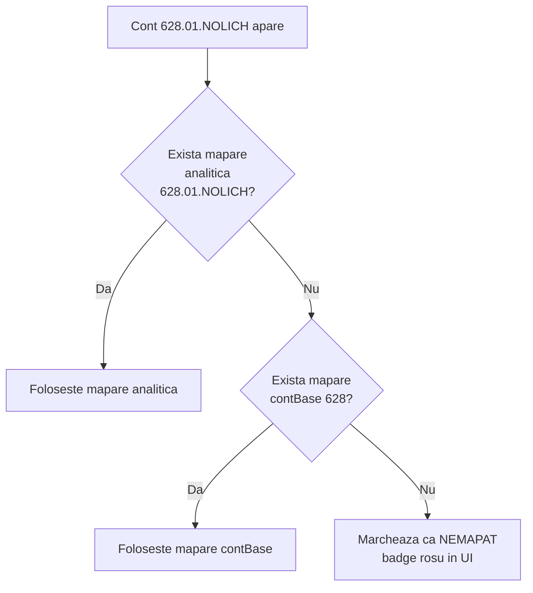

# Categorii (axa A) — referinta in profunzime

## Ce este o categorie

O **categorie** este eticheta patron-friendly sub care antreprenorul vede grupate cheltuielile sau veniturile firmei pe pagina `/firma`.

Exemple:
- *Salarii si contributii*
- *Servicii externe (chirie, IT, contabilitate)*
- *Electricitate, apa, intretinere*
- *Vanzari (cifra de afaceri)*

Categoriile traduc **natura economica** a unei cheltuieli/venit — cu cuvinte pe care le intelege oricine, nu in coduri OMFP.

| In limbajul contabilului | In limbajul antreprenorului |
|--------------------------|------------------------------|
| Conturile clasa 641, 645 | "Salarii si contributii" |
| Conturile 605, 604 | "Energie, apa, intretinere" |
| Contul 7011 | "Vanzari" |

---

## Ce NU este o categorie

Categoria **NU este o linie de business**. NU spune "din ce activitate au venit banii" — spune doar "ce fel de plata a fost".

- ✗ "Outsourcing IT" NU e categorie. Este verticala. Vezi [verticale.md](./verticale.md).
- ✗ "Proiect Bucuresti" NU e categorie. Este verticala.
- ✓ "Salarii", "Electricitate", "Vanzari" SUNT categorii.

Daca incepi sa creezi categorii cu nume ca "Cheltuieli Outsourcing" sau "Vanzari Coworking", **modelul se sparge**. Vor exista 3x mai multe categorii, dar nu vei putea raspunde la intrebari de tipul "cati bani s-au cheltuit pe salarii in toata firma".

---

## Structura ierarhica

Categoriile suporta **un singur nivel de sub-categorii** (parinte → copii). Adancimea mai mare e blocata pentru ca devine ilizibil pentru patron.

```
Salarii si contributii                  (parinte)
  ├── Salarii brut                     (copil)
  ├── Bonusuri si comisioane           (copil)
  └── Contributii angajat              (copil)
```

Pe `/firma`, parintele apare cu totalul rolled-up + bara, copiii apar indentati ca detail rows:

```
Salarii si contributii      45.000 lei  ████████████  53%
  › Salarii brut            35.000 lei
  › Bonusuri                 7.000 lei
  › Contributii              3.000 lei
```

---

## Categorii default OMFP (autoseed)

La prima vizita pe tab-ul **Mapari Cashflow**, sistemul creeaza automat 16 categorii standard, plus maparile lor catre conturile OMFP corespunzatoare:

### Cheltuieli (10)

| Categorie | Conturi OMFP mapate auto |
|-----------|--------------------------|
| Marfa, materii prime si materiale | 600, 601, 602, 603, 604, 607, 608 |
| Energie, apa, intretinere | 605, 611 |
| Servicii externe (chirie, IT, contabilitate) | 612, 613, 614, 622, 623, 624, 625, 626, 627, 628 |
| Taxe si impozite (altele decat profit) | 635 |
| Salarii si contributii | 641, 642, 643, 644, 645, 646 |
| Comisioane bancare si diferente curs | 627, 665 |
| Dobanzi si cheltuieli financiare | 663, 664, 666, 667, 668 |
| Cheltuieli exceptionale | 658, 6587 |
| Amortizare si provizioane | 681, 686, 687 |
| Impozit pe profit | 691 |

### Venituri (6)

| Categorie | Conturi OMFP mapate auto |
|-----------|--------------------------|
| Vanzari (cifra de afaceri) | 701, 702, 703, 704, 705, 706, 707, 708 |
| Subventii din exploatare | 7411, 7412, 7414 |
| Alte venituri din exploatare | 754, 758, 7588 |
| Venituri financiare | 762, 764, 765, 766, 767, 768 |
| Venituri exceptionale | 7588, 791 |
| Reluari de amortizari si provizioane | 781, 786, 787 |

Aceste categorii primesc badge **OMFP** in UI si **nu pot fi sterse** — sunt fundamentul pe care se construieste pagina `/firma`. Pot fi insa **redenumite** sau **ne-mapate** (mutand conturile la alta categorie).

---

## Cand modifici categoriile

### Cazuri uzuale

1. **Patronul vrea sa separe ceva ce OMFP grupeaza**.
   - Default: *Servicii externe (chirie, IT, contabilitate)* aduna toate 612-628.
   - Patron: "vreau sa vad Marketing online distinct".
   - Solutie: creezi categoria *Marketing online*. In Pasul 3, muti contul 6231 sau analiticul specific (de exemplu 628.GOOGLE-ADS) la noua categorie.

2. **Patronul nu intelege un termen OMFP**.
   - Default: *Cheltuieli exceptionale*.
   - Patron: "ce inseamna exceptionale?".
   - Solutie: redenumesti la *Cheltuieli neobisnuite (amenzi, daune)*. Conturile raman mapate, doar eticheta se schimba.

3. **Patronul vrea decomposition pe sub-categorii**.
   - Default: *Salarii si contributii* total 45.000 lei.
   - Patron: "vreau sa vad cat e brut si cat e bonus".
   - Solutie: sub *Salarii*, creezi copiii *Salarii brut*, *Bonusuri*, *Contributii*. In Pasul 3, muti maparile fine: contul 641 default → *Salarii brut*, conturile 6411 (daca exista in jurnal) → *Bonusuri*, etc.

### Cazuri pe care **NU** trebuie sa le rezolvi cu categorii

- **"Vreau sa vad cat aduce Outsourcing-ul vs Coworking-ul"** → astea sunt VERTICALE, nu categorii. Vezi [verticale.md](./verticale.md).
- **"Vreau sa stiu cat a platit firma catre NOLICH SRL"** → NU creezi o categorie "NOLICH". In Pasul 3, alocare individuala pe contul analitic 401.NOLICH, sau folosesti "Top cheltuieli ale lunii" care arata top 10 parteneri automat.
- **"Vreau sa filtrez pe luni"** → este deja in pagina `/firma`, nu se rezolva cu categorii.

---

## Mecanismul de mapare

Fiecare categorie are 0..N conturi mapate. Maparea poate fi:

| Scope | Inseamna | Exemplu |
|-------|----------|---------|
| **contBase** | Toate conturile cu acelasi cod de baza | "628 → Servicii externe" prinde 628, 628.01, 628.NOLICH, 628.AWS |
| **analitic** | Doar acel cont specific | "628.01.NOLICH → Outsourcing IT" (override pe baza) |

Cand un cont apare in jurnal, motorul cauta maparea **in ordinea asta**:



Astfel, default-urile OMFP merg pe contBase (cuvant scurt, prinde tot), iar overridurile specifice merg pe analitic.

---

## Cum se vad categoriile pe `/firma`

### "Unde s-au dus banii"

Lista descendenta a cheltuielilor lunii pe categorii, cu bara orizontala proportionala:

```
Salarii si contributii      45.000 lei  ████████████████████  53%
Servicii externe            23.000 lei  ████████████          27%
Electricitate, apa           8.000 lei  ████                   9%
Marfa, materii prime         5.000 lei  ██                     6%
Taxe si impozite             4.500 lei  ██                     5%
```

### "De unde au venit banii"

Acelasi format, pentru clasa 7:

```
Vanzari                    420.000 lei  ████████████████████  84%
Servicii de recrutare       80.000 lei  ████                  16%
```

### Sub-categorii indentate

```
Salarii si contributii      45.000 lei  ████████████          53%
  › Salarii brut            35.000 lei
  › Bonusuri                 7.000 lei
  › Contributii              3.000 lei
```

### Categorii cu mai multe verticale

Categoriile sunt **ortogonale** cu verticalele. Aceeasi categorie *Electricitate* poate fi divizata 60/40 intre Outsourcing si Coworking pe axa B, fara sa fie nevoie de doua categorii "Electricitate Outsourcing" + "Electricitate Coworking". Vezi [verticale.md](./verticale.md).

---

## Reguli pe care le impune sistemul

| Regula | Mecanism |
|--------|----------|
| Numele categoriei trebuie sa fie unic in cadrul firmei | Constraint unique pe `(clientId, name)` in `CostCategory` |
| Categoria OMFP default nu poate fi stearsa | Flag `isOmfpDefault=true`, butonul Delete disabled cu tooltip |
| Sub-categoria nu poate avea sub-copii | Constraint `parentId` accepta doar categorii fara parent |
| O categorie nu poate fi mutata la alt tip (cheltuiala vs venit) | Field `kind` este readonly dupa creare |
| Conturile mapate la o categorie stearsa devin nemapate | Cascade-friendly delete + warning in UI |
| Modificarile sunt audit-uite | Fiecare CREATE / UPDATE / DELETE inregistrat in audit log |

---

## Sfaturi practice

1. **Lasa OMFP defaults asa cum sunt** pana cand patronul cere ceva concret. Personalizarea premature e zgomot.
2. **Maxim 12-15 categorii vizibile** pe `/firma`. Daca lista devine prea lunga, paginatie nu exista — patronul pierde atentia. Foloseste sub-categorii pentru detalii.
3. **Verifica conturile mari intai**. Daca rulajul lunii are 80% in top 10 conturi, asigura-te ca acelea sunt mapate corect. Restul pot ramane pe OMFP defaults.
4. **Nu folosi categorii pentru a face raportare avansata**. Raportarea operationala (pe proiecte, parteneri, perioade) se face din alte tab-uri sau via export.

---

## Implementare tehnica (referinta dezvoltator)

- Model: `CostCategory { id, clientId, name, kind, parentId?, isOmfpDefault, sortOrder }`
- Mapping model: `AccountCategoryMapping { id, clientId, categoryId, scope: contBase|analitic, code }`
- Auto-seed: `src/modules/categories/seed.ts` — idempotent, ruleaza la prima vizita pe `/clients/{slug}?tab=mapari-cashflow`
- Resolver: `src/modules/categories/resolver.ts` — primeste un cont, returneaza categoria (analitic → contBase → null)
- Compute: `computeExpenseBreakdownFromCategories` + counterpart pentru venituri in `src/modules/reporting/owner/compute.ts`
- Tests: `tests/unit/modules/categories/`

---

*Vezi si: [verticale.md](./verticale.md) (axa B, ortogonala) si [exemplu-qhm21.md](../exemplu-qhm21.md) (caz real complet)*
