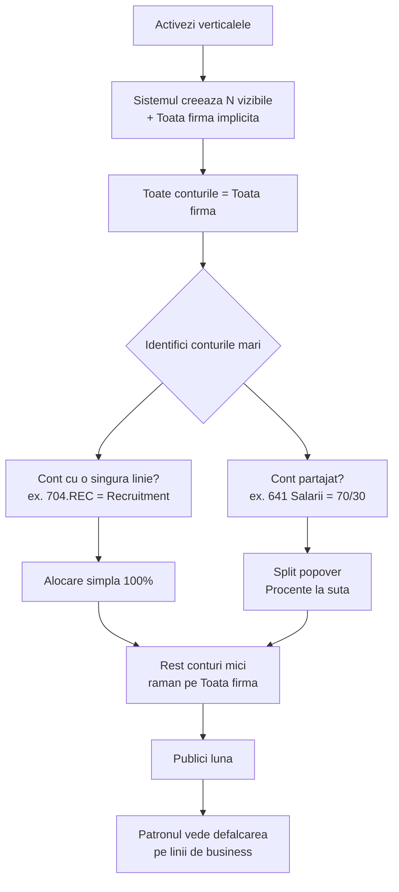

# Verticale (axa B) — referinta in profunzime

## Ce este o verticala

O **verticala** este o **linie de business** pe care patronul vrea sa o urmareasca SEPARAT de restul firmei.

Exemple:
- **QHM21 NETWORK SRL** → *Outsourcing*, *Recruitment*, *Coworking*
- **Restaurant cu 3 canale** → *Sala*, *Catering*, *Delivery*
- **Constructii cu mai multe proiecte** → *Proiect Bucuresti*, *Proiect Cluj*, *Service*
- **SaaS cu 2 produse** → *Produs A*, *Produs B*, *Consultanta*

Verticala raspunde la intrebarea: **"cati bani aduce si cati bani cheltuieste FIECARE linie de business?"**

---

## Ce NU este o verticala

Verticala NU este:

- ✗ **O categorie de cheltuiala** (acelea sunt pe axa A — *Salarii*, *Electricitate*, etc.). Vezi [Categorii (axa A)](/docs/cashflow-categorii).
- ✗ **Un client mare** (acelea apar automat in "Top cheltuieli / Top clienti", nu necesita verticala).
- ✗ **O perioada de timp** (luni, trimestre — sunt deja in pagina, nu necesita verticale).
- ✗ **Un departament intern** (HR, IT, Vanzari) — daca patronul vrea sa vada cat costa HR-ul, e o sub-categorie de Salarii, nu o verticala. Verticala = **sursa de venit**, nu cost center.

---

## Cele doua axe sunt independente

Verticalele si categoriile sunt **ortogonale**. Aceeasi cheltuiala poate exista pe ambele simultan:

```
                     QHM21 NETWORK SRL — aprilie 2026

                  AXA A: Categorii                AXA B: Verticale

                  ┌─────────────────┐             ┌─────────────────┐
                  │ Salarii         │             │ Outsourcing     │
   Plata          │ Electricitate   │             │ Recruitment     │
   "Electricitate │ Servicii ext.   │   ×         │ Coworking       │
   sediu = 12k"   │ Marfa           │             │ Toata firma     │
                  │ ...             │             │                 │
                  └─────────────────┘             └─────────────────┘

                  apare la: Electricitate         apare la: 60% Coworking
                  (categoria 12k cu bara)         40% Outsourcing
                                                  (split pe verticale)
```

**De ce e important**: poti raspunde la doua intrebari diferite cu acelasi numar:
- "Cat platim pe electricitate in total?" → 12.000 lei (axa A — categorie)
- "Cat costa coworking-ul lunar?" → contributia din electricitate (60% × 12k = 7.200) + chirie + parte din salarii etc. (axa B — verticala)

Fara verticale, raspunsul la a doua intrebare nu exista. Tot ce vezi sunt totale globale.

---

## Cand activezi verticalele

### Activeaza daca:

1. **Firma are mai multe linii distincte de business** care concureaza intern pentru resurse (oameni, spatiu, atentie).
2. **Patronul a intrebat explicit** "vreau sa stiu cati bani aduce X versus Y".
3. **Vor exista decizii operationale concrete** bazate pe profitabilitatea fiecarei linii. Ex: "Outsourcing-ul subventioneaza Coworking-ul, gandeste-te daca inchidem Coworking-ul".

### NU activa daca:

1. **Firma are o singura linie de business** (cea mai comuna situatie). Tot ce face firma e sub aceeasi umbrela. Verticalele nu adauga valoare.
2. **Patronul nu intelege diferenta** dintre "venituri pe linii" si "venituri pe categorii". Lasa-l prima data sa vada pagina globala. Dupa 1-2 luni de utilizare, va sti exact ce vrea.
3. **Toate cheltuielile sunt deja in categorii separate**. Daca esti restaurant si Sala vs Delivery au conturi complet diferite (Sala = doar 605/641 sediu fizic, Delivery = doar 624 transport), poti vedea defalcarea fara verticale, doar prin categorii.

---

## Activarea (pasul 2 in Mapari Cashflow)

Click pe **Activeaza verticale**. Apare modalul de bootstrap:

```
Configureaza verticalele firmei
─────────────────────────────────
Scrie numele liniilor de business pe care vrei sa le urmaresti.
Vor aparea pe pagina /firma sub "Pe linii de business".

1. [Outsourcing                     ]
2. [Recruitment                     ]
3. [Coworking                       ]
+ adauga inca una (max 5 initiale)

Verticala "Toata firma" se creeaza automat ca fallback
pentru conturi nealocate.

                    [Renunta]  [Salveaza si continua]
```

Save → sistemul creeaza N row-uri vizibile + 1 "Toata firma" (implicita, nu poate fi stearsa). Toate conturile devin alocate la "Toata firma" pana le mutam.

---

## Verticala implicita "Toata firma"

Cand activezi, sistemul creeaza automat o verticala speciala numita **Toata firma** (sau ce nume vrei tu — poate fi redenumita).

Aceasta verticala:

- **Nu poate fi stearsa**. Este intotdeauna ultima optiune.
- **Este default pentru conturile fara alocare explicita**. Daca nu te atingi de un cont, el ramane aici.
- **Apare ultima pe `/firma`** in sectiunea "Pe linii de business".
- **Acopera situatia reala**: in orice firma exista cheltuieli partajate (contabilitate, software comun, comisioane bancare, taxe locale) care nu se pot atribui clar unei linii. Acelea raman pe "Toata firma" si patronul vede "ce face firma in general".

Acest design **garanteaza** ca suma verticalelor = totalul firmei. Nu poti avea cheltuieli "pierdute" intre verticale.

---

## Alocarea: simpla vs split

Fiecare cont (la Pasul 3 in Mapari Cashflow) poate fi alocat la verticale in 2 moduri:

### 1. Alocare simpla (100% intr-o verticala)

```
Cont 704.REC                rulaj 80.000 lei
  Verticala: Recruitment    ← 100%, alegere directa
```

Tot rulajul contului merge intr-o singura verticala. Cel mai comun pattern pentru conturi analitice specifice unei linii.

### 2. Alocare cu split (procente intre 2-5 verticale)

```
Cont 641 Salarii            rulaj 50.000 lei
  Click dropdown → "Impartit intre mai multe verticale..."

  Popover Split:
  ─────────────────────────────────────
    Outsourcing      [▬▬▬▬▬▬▬░░░] 70 %
    Recruitment      [▬▬▬░░░░░░░] 30 %
    + adauga verticala

    Total: 100%                  [Salveaza]
```

Sistemul aplica automat split-ul pe fiecare rulaj. In cazul de sus:
- Outsourcing primeste 35.000 lei (70% × 50.000)
- Recruitment primeste 15.000 lei (30% × 50.000)

### Reguli pentru split

- Minim 2 verticale, maxim 5 (peste devine ilizibil).
- Total = 100% (sistemul forteaza).
- Procentele sunt intregi (70, nu 70.5).
- La calcul, **ultimul slice primeste remainder-ul** pentru a evita pierderi de banuti din rotunjire. Ex: 100 lei × 33% × 3 verticale = 33 + 33 + 34 = 100.
- Modificarile la split sunt audit-uite.

---

## Cum se vede pe `/firma`

### Sectiunea "Pe linii de business"

```
Pe linii de business — aprilie 2026
─────────────────────────────────────
  Outsourcing                       │ ████████████████  bara mare
    venituri    320.000 lei         │
    cheltuieli  250.000 lei         │
    profit       70.000 lei  +22%   │ marja
                                    │
  Recruitment                       │ ████      bara mica
    venituri     80.000 lei         │
    cheltuieli   60.000 lei         │
    profit       20.000 lei  +25%   │
                                    │
  Coworking                         │ ██
    venituri     40.000 lei         │
    cheltuieli   35.000 lei         │
    profit        5.000 lei  +12%   │
                                    │
  Toata firma                       │ █
    venituri     20.000 lei         │
    cheltuieli   18.000 lei         │
    profit        2.000 lei         │
```

Verticalele sunt sortate descrescator dupa venituri. Verticala implicita "Toata firma" apare intotdeauna ultima.

### "Top cheltuieli ale lunii" arata verticala

```
1. NOLICH SRL                      23.451 lei  (Outsourcing)
2. Salarii decembrie               18.000 lei  (Outsourcing 70%, Recr. 30%)
3. MONT BLANC INDUSTRI              5.300 lei  (Outsourcing)
4. Chirie Eminescu 1                6.000 lei  (Coworking 60%, Outs. 40%)
```

Patronul vede instantaneu pe ce linie de business merge fiecare plata mare.

---

## Workflow tipic de configurare



**Best practice**: aloca doar conturile cu rulaj mare (>5.000 lei/luna). Restul lasa-le pe "Toata firma". Configurarea pe fiecare cont mic e munca inutila — nu schimba decizii operationale.

---

## Schimbari, dezactivare, re-activare

### Adaugi o verticala noua

Sectiunea "Verticalele firmei" → buton "+ Adauga verticala". Apare in lista, nu are inca alocari. Tu o aloci la conturile relevante in Pasul 3.

### Redenumesti o verticala

Hover pe nume → buton edit. Schimbi numele. Toate alocarile existente raman intacte (legatura e prin ID, nu prin nume).

### Stergi o verticala

Hover pe nume → buton delete. Confirmare. Sistemul:
1. Sterge verticala.
2. Reseteaza alocarile pe conturile care o foloseau la "Toata firma" implicit.
3. Audit eveniment.

**Exceptie**: verticala "Toata firma" nu poate fi stearsa (e implicita).

### Dezactivezi modulul verticalelor

Buton "Dezactiveaza" la baza sectiunii. Sistemul:
1. **Nu sterge** datele (verticale, alocari, splituri raman in DB).
2. Ascunde coloana "Verticala" din Pasul 3.
3. Ascunde sectiunea "Pe linii de business" pe `/firma`.

Daca reactivezi mai tarziu, totul revine exact cum era. Datele sunt prezervate.

---

## Reguli pe care le impune sistemul

| Regula | Mecanism |
|--------|----------|
| Numele verticalei trebuie sa fie unic in cadrul firmei | Constraint unique pe `(clientId, name)` in `Vertical` |
| Verticala "Toata firma" (implicit=true) nu poate fi stearsa | Flag `isDefault=true`, buton Delete disabled |
| Split-urile au minim 2 si maxim 5 entrii | Validare in `setAllocation` action |
| Suma procentelor = 100 | Forced de UI + validat in service |
| Verticalele sunt strict per firma (per Client) | Constraint `clientId` direct pe `Vertical` |
| Modificarile sunt audit-uite | Fiecare create/update/delete pe `Vertical` si `VerticalAllocation` |

---

## Cum se aplica matematic la calcul

Cand sistemul calculeaza "Pe linii de business" pentru o luna:

```
Pentru fiecare cont contabilizat in luna:
  rulaj = absolutValue(rulajD − rulajC)   // depinde de tip cont
  allocation = getAllocation(cont)         // analitic → contBase → "Toata firma" fallback

  Daca allocation este split:
    Pentru fiecare slice in split:
      vertical[slice.id] += rulaj × slice.percent / 100

  Altfel (alocare simpla):
    vertical[allocation.id] += rulaj

Output:
  Pentru fiecare verticala:
    venituri = suma rulaje clasa 7 alocate
    cheltuieli = suma rulaje clasa 6 alocate
    profit = venituri − cheltuieli
    marja = profit / venituri × 100
```

Functia: `computeVerticalBreakdown` in `src/modules/reporting/owner/compute.ts`.

---

## Cazuri tipice (referinta rapida)

### Restaurant cu 3 canale

```
Verticale:
  • Sala         • Catering        • Delivery      • Toata firma

Splituri tipice:
  • 641 Salarii bucatari → 60/30/10
  • 605 Electricitate    → 70/20/10
  • 624 Transport        → 100% Delivery
  • 628 Software POS     → 70/20/10 (proportional cu volumul)
```

### Constructii cu 2 proiecte mari

```
Verticale:
  • Proiect Bucuresti     • Proiect Cluj    • Service    • Toata firma

Strategie:
  • Materiale (605 cu cont analitic pe proiect) → 100% per proiect
  • Manopera (641) → split lunar pe pondere ore pontate
  • Echipa management → ramane pe Toata firma
```

### SaaS cu 2 produse

```
Verticale:
  • Produs A     • Produs B     • Consultanta    • Toata firma

Strategie:
  • Servere AWS A si B (conturi analitice 628.AWS-A, 628.AWS-B) → 100% per produs
  • Salarii dev specifice (641 cu analitic 641.PRODA, 641.PRODB) → 100%
  • Salarii echipa core (641 fara analitic) → ramane pe Toata firma
  • Marketing global (623) → split aproximativ (60/30/10 in functie de prioritate)
```

### Coworking cu 2 locatii

```
Verticale:
  • Eminescu 1     • Eminescu 2    • Toata firma

Strategie:
  • Chirie + utilitati cu cont analitic per locatie → 100% per locatie
  • Salarii receptie cu pontaj → split lunar
  • Marketing comun → ramane pe Toata firma sau split 50/50
```

---

## Capcane comune

1. **Splituri pe prea multe conturi mici.** Pierdere de timp, nu schimba decizii. Aloca doar conturile mari.
2. **Nume verticale prea lungi sau confuze.** "Outsourcing IT pentru clienti enterprise" e prea lung. "Outsourcing" + tooltip e mai bine.
3. **Verticale care nu se exclud.** "Outsourcing" si "IT" se suprapun — patronul nu va sti unde sa se uite. Trebuie sa fie linii distincte, nu adjective.
4. **Folosirea verticalelor pentru cost centers**. "HR", "Vanzari", "IT" nu sunt verticale — sunt departamente. Verticala trebuie sa fie sursa de venit, nu locul unde se cheltuie.
5. **Refuzul de a folosi "Toata firma"**. Patronul nu trebuie sa vada 100% alocat la verticale specifice. Cheltuielile cu adevarat comune raman pe "Toata firma" si e in regula.

---

## Implementare tehnica (referinta dezvoltator)

- Modele:
  - `Vertical { id, clientId, name, isDefault, sortOrder, deletedAt }`
  - `VerticalAllocation { id, clientId, scope: contBase|analitic, code, splits: JSON[{ verticalId, percent }] }`
  - `Client.verticalsEnabled: Boolean`
- Resolver: `src/modules/verticals/resolver.ts` cu `applySplit()` care imparte sumele si gestioneaza remainder-ul rotunjirii in ultimul slice.
- Compute: `computeVerticalBreakdown` in `src/modules/reporting/owner/compute.ts`.
- Snapshot field: `OwnerSnapshot.verticalBreakdown: VerticalBreakdownItem[]`.
- Tests: `tests/unit/modules/verticals/`.

---

*Vezi si: [Categorii (axa A)](/docs/cashflow-categorii) (axa A, ortogonala) si [Exemplu QHM21](./docs/cashflow-exemplu-qhm21) (configurare reala pe firma cu 3 verticale)*
